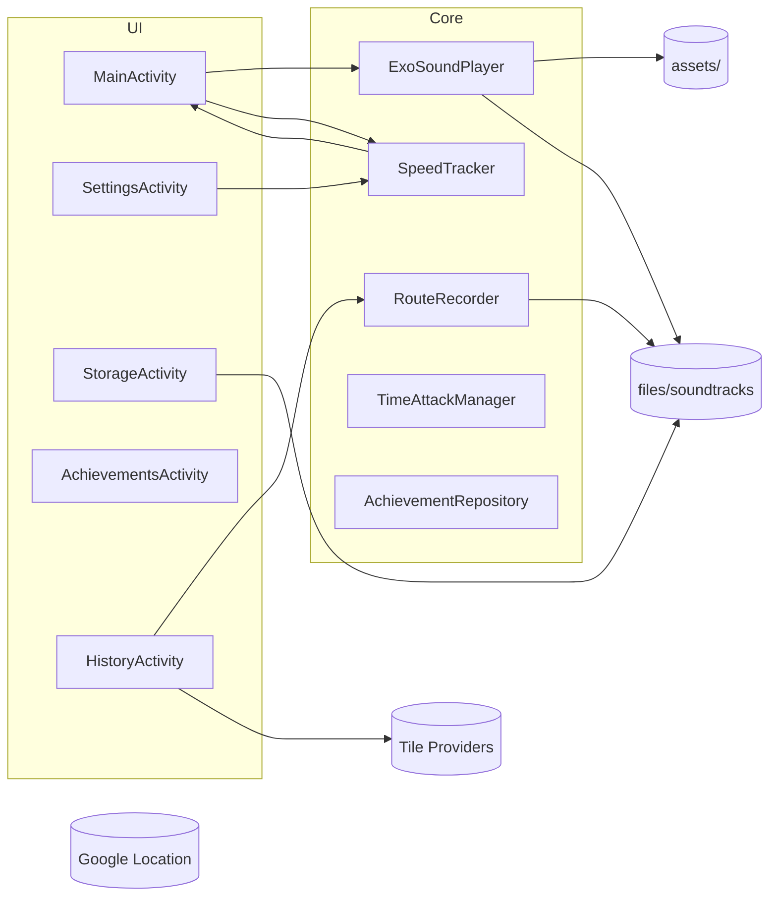

# Portal 2 Adaptive Songs — Документация для разработчиков

Последнее обновление: 2025‑08‑16

Этот документ — быстрый гид для новых разработчиков. Он описывает назначение приложения, архитектуру, ключевые компоненты, ресурсы, правила локализации/темизации, хранение данных, а также советы по развитию и отладке.

## Что нового в 1.3.1 (кратко для девов)
- Тайм‑атака:
  - Добавлена сложность «Экстрим» (X1–X4), локализация RU/EN, вес выпадения снижен.
  - Первая задача сессии — «Ровный старт» (E2), но только при уместном контексте; иначе откладывается.
  - В рамках одной сессии выполненные задачи не повторяются.
  - Контекстная фильтрация задач (superspeed‑задания не появляются, если скорость ниже порога, и наоборот).
- UI тайм‑атаки: крупный заголовок, тонкий скруглённый прогресс‑бар, плавная анимация обновления.
- ExoSoundPlayer: проверка наличия вариантов перед подготовкой; устранены ошибки `FileNotFoundException: /normal.wav` и подобные.
- Минорные улучшения стабильности/UX.

## Обзор
Android‑приложение на Kotlin для адаптивного воспроизведения саундтрека Portal 2 в зависимости от скорости пользователя. Источник аудио — предустановленные ассеты и/или импортированные пользователем треки. Переключение между «обычным» и «ускоренным» вариантами треков выполняется плавным кроссфейдом, в реальном времени, по данным о скорости.

- Язык: Kotlin
- Сборка: Gradle Kotlin DSL
- Модулей: 1 (app)
- minSdk 30, targetSdk 33, compileSdk 34
- Включён ViewBinding

Основные зависимости:
- ExoPlayer 2.19.1 — аудио‑плеер
- Google Play Services Location 21.2.0 — геолокация
- Material Components 1.10.0 — UI
- AndroidX — AppCompat, RecyclerView и пр.
- Карта: osmdroid (используется в экране истории маршрутов; убедитесь, что зависимость подключена в Gradle)

## Быстрый старт
### Требования
- Android Studio (рекомендуется последняя стабильная версия)
- Android SDK 33/34
- JDK 17+ (в соответствии с используемой версией AGP)

### Сборка и запуск
1. Откройте корень проекта в Android Studio.
2. Дождитесь синхронизации Gradle.
3. Запустите конфигурацию `app` (Debug). Подпись не требуется.

Примечание: сборку из командной строки выполнять не требуется для начала работы. Команды Gradle можно найти в разделе «Триаж и отладка» при необходимости.

## Структура проекта
```
app/
  src/main/java/com/f1xtrack/portal2adaptivesongs/
    MainActivity.kt                 — главный экран, список треков, меню, тема/язык, запуск тайм‑атаки
    SettingsActivity.kt             — основные настройки
    OnboardingActivity.kt            — первый запуск (язык, загрузка саундтреков)
    RouteSettingsActivity.kt        — настройки карты/маршрутов (OSM - источники тайлов)
    TimeAttackSettingsActivity.kt   — настройки тайм‑атаки
    HistoryActivity.kt              — история маршрутов с картой (osmdroid)
    StorageActivity.kt              — хранилище треков
    AchievementsActivity.kt         — достижения
    ExoSoundPlayer.kt               — воспроизведение, выбор вариантов, кроссфейд
    SpeedTracker.kt                 — скорость/дистанция
    RouteRecorder.kt                — запись истории маршрутов (JSONL)
    TracksAdapter.kt                — список треков (UI)
    TimeAttackManager.kt            — логика и диалог тайм‑атаки
  src/main/res/
    layout/                         — макеты экранов и диалогов (в т.ч. dialog_time_attack.xml)
    values[-XX]/                    — строки, цвета, темы (см. раздел локализации)
  src/main/assets/
    <track_name>/                   — аудио‑ассеты (см. ниже)
```

## Онбординг (первый запуск)
- Экран `OnboardingActivity`: выбор языка интерфейса и загрузка архива саундтреков.
- Архив скачивается с GitHub Releases и распаковывается во внутренний каталог `files/soundtracks/`.
- Прогресс: `LinearProgressIndicator` (проценты при известном размере), диалоги подтверждения/ошибки на Material.
- Настройки: язык сохраняется в `ui_prefs.app_lang` (`"system"`/код языка), флаг завершения онбординга — `onboarding_prefs.onboarding_completed`.

## Архитектура (общее)
Ключевые потоки данных:
- SpeedTracker измеряет скорость и сообщает в UI; UI инициирует переключения в ExoSoundPlayer.
- ExoSoundPlayer управляет двумя плеерами (normal/superspeed) и standby‑плеерами, выполняет кроссфейд и безопасность подготовки.
- RouteRecorder пишет историю в JSONL; HistoryActivity читает и рисует маршрут на карте (osmdroid).
- StorageActivity управляет файлами треков (встроенные/импортированные), статистикой и очисткой истории.
- TimeAttackManager управляет диалогом испытаний и сценарием тайм‑атаки.

Диаграмма (упрощённо):


## Аудио: ассеты и воспроизведение
### Организация ассетов
Для каждого трека существует папка в `app/src/main/assets/<track_name>/`. Ожидаемые файлы:
- Обычный вариант: `normal.wav`, возможны варианты `normal2.wav`, `normal3.wav`, …
- Ускоренный вариант: `superspeed.wav`, возможны варианты `superspeed2.wav`, `superspeed3.wav`, …

Имя без расширения — «вариант» (variant). Воспроизведение из пользовательских треков (импортированных) использует тот же шаблон, но файлы хранятся во внутреннем каталоге приложения: `files/soundtracks/<track_name>/`.

### Выбор варианта и безопасная подготовка
`ExoSoundPlayer`:
- `choosePlayableVariant(...)` — перебирает кандидатные имена вариантов и пытается подготовить плеер. Если формат WAV неподдерживаем/битый, вариант пропускается.
- `createPreparedPlayerSafe(...)` — защищённая подготовка ExoPlayer с try/catch; при ошибке возвращает `null`, приложение не падает.
- Убраны длинные/расширённые версии треков. В коде и ресурсах нет ссылок на «удлинённые версии».

### Плавный кроссфейд
- Одновременно готовятся активные плееры (обычный/ускоренный) и «standby» плееры для следующего переключения.
- `crossfadeTo(trackName, toSuperSpeed, isUserTrack)` — переключение логического режима.
- `performCrossfade(from, to, onComplete)` — постепенная смена громкостей, по шагам через `Handler.postDelayed` (~1 секунда). Если standby‑вариант неподготовлен, кроссфейд пропускается с логированием (без крэша).

## Получение скорости и запись маршрутов
`SpeedTracker` использует LocationManager/Play Services для получения скорости и дистанции. Логи «сырых» скоростей отключены в релевантных сборках.

`RouteRecorder` пишет историю маршрутов в `routes_history.jsonl` (JSON Lines) во внутреннем хранилище. Очистка доступна из `StorageActivity` и/или `HistoryActivity`.

## Экран истории маршрутов (HistoryActivity)
- Отображение маршрутов на карте (osmdroid).
- Легенда, управление периодом и очисткой истории.
- Тема карты соответствует теме приложения. Используется только OSM; источник тайлов выбирается в `RouteSettingsActivity` (например, MAPNIK, USGS Topo/Sat). При смене источника обновляются тайлы и масштаб.

### Gradle
```kotlin
implementation("org.osmdroid:osmdroid-android:6.1.18")
```

### Manifest (минимум)
```xml
<uses-permission android:name="android.permission.INTERNET" />
<uses-permission android:name="android.permission.ACCESS_NETWORK_STATE" />
```

### Инициализация и кэш
```kotlin
override fun onCreate(savedInstanceState: Bundle?) {
    super.onCreate(savedInstanceState)

    val prefs = getSharedPreferences("osmdroid", MODE_PRIVATE)
    Configuration.getInstance().load(this, prefs)
    Configuration.getInstance().userAgentValue = BuildConfig.APPLICATION_ID
    // API 30+: храните кэш в sandbox
    Configuration.getInstance().osmdroidBasePath = File(cacheDir, "osmdroid")
    Configuration.getInstance().osmdroidTileCache = File(cacheDir, "osmdroid/tiles")

    val map = findViewById<MapView>(R.id.map)
    map.setMultiTouchControls(true)
    map.setTileSource(TileSourceFactory.MAPNIK)
}
```

### Рисование маршрута
```kotlin
val points = routePoints.map { GeoPoint(it.lat, it.lon) }
val polyline = Polyline().apply {
    outlinePaint.color = ContextCompat.getColor(this@HistoryActivity, R.color.portal_orange)
    outlinePaint.strokeWidth = 6f * resources.displayMetrics.density
}
polyline.setPoints(points)
map.overlays.add(polyline)
map.invalidate()
```

### Подбор масштаба
```kotlin
val bbox = BoundingBox.fromGeoPoints(points)
map.zoomToBoundingBox(bbox, true, 64)
```

### Светлая/тёмная тема и провайдер тайлов
```kotlin
val dark = XYTileSource(
    "CartoDB.DarkMatter", 1, 19, 256, ".png",
    arrayOf(
        "https://cartodb-basemaps-a.global.ssl.fastly.net/dark_all/",
        "https://cartodb-basemaps-b.global.ssl.fastly.net/dark_all/",
        "https://cartodb-basemaps-c.global.ssl.fastly.net/dark_all/",
        "https://cartodb-basemaps-d.global.ssl.fastly.net/dark_all/"
    ),
    "© CartoDB"
)
map.setTileSource(if (isDarkTheme) dark else TileSourceFactory.MAPNIK)
```

Рекомендации:
- На Android 11+ не запрашивайте доступ к общему хранилищу — используйте `cacheDir` для кэша.
- Всегда задавайте `userAgentValue` (например, `BuildConfig.APPLICATION_ID`).
- При смене темы пересоздавайте источник тайлов.

## Хранилище треков (StorageActivity)
- Просмотр встроенных и импортированных треков в одном списке.
- Действия: удалить (любой), скрыть/показать, очистить статистику, очистить историю маршрутов.
- `MainActivity` обновляет список при `onResume` после возврата из `StorageActivity`.

## Достижения
- Экран/логика: `AchievementsActivity`, `AchievementsAdapter`, `AchievementRepository`.
- Учитываются как встроенные, так и импортированные треки (например, импорт для счётчиков достижений).
- Есть достижения, связанные с «ускоренным» режимом (10/60/600 минут и т.п.).

## Тайм‑атака
- UI: `dialog_time_attack.xml` (Material), `TimeAttackManager` показывает диалог и управляет прогрессом.
- Пункты меню в `MainActivity` и секция в `SettingsActivity` позволяют выбрать сложность и запускать испытание.
- Строки тайм‑атаки находятся в основных `strings.xml` по локалям.
- 1.3.1: добавлена «Экстрим», контекстная фильтрация, «Ровный старт» первым, сессионная уникальность задач.

## Настройки
`SettingsActivity` содержит:
- Переключатель использования сетевой локации (Wi‑Fi/сеть) как дополнение к GPS.
- Слайдер интервала записи маршрута.
- Настройки тайм‑атаки (сложность, «запустить сейчас»).
- «Порог Панели Веры» (Faith Plate Threshold) — порог скорости для ускоренного варианта трека.

Строки локализации для GPS/карты и интервала записи вынесены в `gps_settings.xml` по локалям. В главном `strings.xml` дубли отсутствуют.

## Локализация и строки ресурсов
- Многоязычие через папки `values-XX`. Основные файлы:
  - `strings.xml` — базовые строки (включая тайм‑атаку).
  - `gps_settings.xml` — строки GPS/карты/интервала записи (если вынесены отдельно в конкретной локали).
- «Faith Plate»: ключи сохраняются, перевод контекстный: 
  - EN — «Faith Plate»,
  - RU — «Панель Веры» (с правильными падежами),
  - другие языки — по смыслу, не дословно.
- Подпись к слайдеру порога: `faith_plate_threshold_label` добавлена во все локали.

## Темы и оформление
Темы реализованы через `themes.xml` и дополнительные цвета (`colors_extras.xml`). Присутствуют стили:
- `Theme.Portal.ASI`
- `Theme.Portal2.Overgrowth`
- `Theme.Portal1`

Применение темы — в `MainActivity` (и по предпочтениям пользователя). Отображаемые названия тем локализуются только там, где брендовые имена официально локализованы (Portal, Aperture Science); в остальных локалях бренды оставляем на английском, а описательные слова — переводим.

Диалоги переведены на Material 3 Centered с кастомным overlay `ThemeOverlay.App.MaterialAlertDialog` (углы «cut» 12dp, кнопки — текстовые, цвета берутся из активной темы). Для совместимости в коде используются `MaterialAlertDialogBuilder`.

## Известные решения/решённые проблемы
- Крэш при переключении «ускоренного» в некоторых треках — исправлено безопасной подготовкой плеера, отказом от неподдерживаемых WAV и защитой кроссфейда.
- Удалены длинные/расширённые версии треков; код и ресурсы приведены к единому формату без генерации «длинных».
- Отключён лишний логгинг скоростей.
- Исправлены подписи и лишние переключатели в `activity_main.xml`.

## Известные задачи и направления развития
- История маршрутов: проверить/добавить зависимость osmdroid, соответствие темы, выбор провайдера, корректное масштабирование, градиент/насыщенность линий.
- Меню истории: выбор периода отображения.
- Достижения: расширенный набор метрик (дистанция, минуты ускорения и т.д.).
- Язык: убедиться, что все пункты меню и экраны переводятся; список языков в меню языка должен соответствовать поддерживаемым локалям.
- Тайм‑атака: диалог Material3, вибрация при провале, точность до 0.01, 30 заданий (по 10 на сложность), не завершать мгновенно при провале.

## Триаж и отладка
- Логи: используйте теги `ExoSoundPlayer-*`, `SpeedTracker`, `RouteRecorder`, `TimeAttack`.
- Аудио: неподдерживаемый WAV (например, ADPCM/Float) — см. логи ExoPlayer; вариант будет пропущен без крэша.
- Нет звука при кроссфейде: проверьте готовность standby‑плеера и наличие файла варианта.
- Карта (osmdroid): проверьте разрешения сети, наличие кэша и user‑agent. На API 30+ кэш должен быть в `cacheDir`.

Полезные команды:
```bash
./gradlew :app:assembleDebug
./gradlew :app:lint
```
Логи (Linux/macOS):
```bash
adb logcat | grep ExoSoundPlayer
```
Логи (Windows PowerShell):
```powershell
adb logcat | Select-String ExoSoundPlayer
```

## Зависимости и версии (ключевые)
- ExoPlayer: 2.19.1
- Play Services Location: 21.2.0
- Material Components: 1.10.0
- AndroidX (AppCompat, RecyclerView и т.д.)
- osmdroid: 6.x (подтвердите в `libs.versions.toml` и `build.gradle.kts`)

## Как добавить новый трек (ассет)
1. Создайте папку `app/src/main/assets/<track_name>/`.
2. Положите файлы `normal.wav` и/или `superspeed.wav`. По желанию — `normal2.wav`, `superspeed2.wav`, …
3. Запустите приложение — трек появится в списке. Воспроизведение выберет первый пригодный вариант и подготовит standby.

Требования к файлам:
- WAV PCM 16‑bit little‑endian, 44.1 или 48 кГц. Избегайте ADPCM/Float/μ‑law/IMA ADPCM.
- Имена строго: `normal.wav`, `normal2.wav`, … и `superspeed.wav`, `superspeed2.wav`, …
- Громкость вариантов выровняйте (без клиппинга), чтобы кроссфейд звучал естественно.
- Желательно избегать длительной тишины в конце/начале — кроссфейд ≈ 1 секунда.

## Импорт треков пользователем
- Файлы размещаются во внутреннем каталоге `files/soundtracks/<track_name>/` с теми же именами вариантов.
- Название папки `<track_name>` должно совпадать с именем трека в списке (латиница/цифры/подчёркивания без пробелов — предпочтительно).
- Разрешены несколько вариантов (`normal2.wav`, `superspeed3.wav` и т.д.) — будут выбраны автоматически из доступных.
- Достижения учитывают и встроенные, и импортированные треки.

## Стандарты кода и вклад
- Kotlin, Android Jetpack, Material.
- Архитектура — лёгкий слой UI + отдельные классы для аудио/трекера/истории/достижений.
- Pull Request: короткие, с понятными описаниями, изменения строк ресурсов в соответствующих `values-XX`.
- Локализация: добавляйте строки сразу во все поддерживаемые локали, избегайте хардкода.

## Глоссарий
- **Normal** — обычный вариант трека (воспроизводится при низкой скорости).
- **Superspeed** — ускоренный вариант трека (воспроизводится при высокой скорости).
- **Variant** — конкретный файл варианта (например, `normal2.wav`, `superspeed3.wav`).
- **Standby** — предварительно подготовленный плеер для следующего переключения.
- **Crossfade** — плавный переход между треками путём изменения громкости.
- **Faith Plate Threshold** — порог скорости (км/ч) для переключения на superspeed.
- **Hysteresis** — гистерезис переключения (разница порогов вверх/вниз для избежания дрожания).
- **Time Attack** — режим испытаний на время с заданиями разной сложности.
- **Route History** — история записанных маршрутов в формате JSONL.
- **User Track** — импортированный пользователем трек (в отличие от встроенного ассета).

## Настройки и SharedPreferences
Основные ключи настроек:

### Основные (`"main_prefs"`)
- `selected_theme` — выбранная тема (`"default"`, `"asi"`, `"portal1"`, `"overgrowth"`).
- `selected_language` — код языка (`"ru"`, `"en"`, `"de"`, и т.д.).
- `faith_plate_threshold` — порог Панели Веры (Float, км/ч).
- `hysteresis_value` — значение гистерезиса (Float, км/ч).

### Хранилище (`"storage_prefs"`)
- `hidden_tracks` — Set<String> скрытых треков.
- `track_play_counts` — количество воспроизведений по трекам (JSON или отдельные ключи).
- `total_distance` — общая пройденная дистанция (Float, км).
- `superspeed_time` — общее время в superspeed (Long, миллисекунды).

### GPS/Трекинг (`"gps_prefs"` или в основных)
- `use_network_location` — использовать Wi‑Fi/сеть (Boolean).
- `recording_interval` — интервал записи маршрута (Int, секунды).
- `location_permission_granted` — разрешение на геолокацию (Boolean).

### UI/Онбординг (`"ui_prefs"`, `"onboarding_prefs"`)
- `app_lang` — выбранный язык интерфейса (`"system"` или BCP‑47 код, например `"ru"`, `"en"`).
- `onboarding_completed` — флаг завершения первоначальной настройки (Boolean).

### Тайм‑атака (`"timeattack_prefs"` или в основных)
- `timeattack_difficulty` — выбранная сложность (`"easy"`, `"normal"`, `"hard"`).
- `timeattack_completed_tasks` — завершённые задания (Set<String> или JSON).
- `timeattack_best_times` — лучшие времена по заданиям (JSON).

### Достижения (`"achievements_prefs"` или в основных)
- `achievement_*` — флаги разблокированных достижений (Boolean).
- `first_launch` — первый запуск приложения (Boolean).
- `tracks_imported_count` — количество импортированных треков (Int).

Пример чтения:
```kotlin
val prefs = getSharedPreferences("main_prefs", Context.MODE_PRIVATE)
val threshold = prefs.getFloat("faith_plate_threshold", 15.0f)
val theme = prefs.getString("selected_theme", "default")
```

Пример записи:
```kotlin
prefs.edit()
    .putFloat("faith_plate_threshold", newThreshold)
    .putString("selected_theme", "asi")
    .apply()
```

## Процесс обновления раздела «Что нового» в README
Эта инструкция нужна при выпуске новой версии для поддержания актуальности README.

1) Перераскидать изменения из предыдущей версии
- В README найдите раздел: `## Добавлено в [предыдущая версия]`.
- Пройдитесь по каждому пункту и перенесите его в соответствующие постоянные разделы README (например, «Основные возможности», «Как добавить треки», «О приложении» и т.д.), при необходимости переформулировав в вневременной форме.
- После перераскидывания убедитесь, что разделы README отражают функциональность без дублирования.

2) Создать раздел для текущего релиза
- Добавьте новый раздел в начале файла: `## Добавлено в [эта версия]`.
- Внесите все нововведения/исправления текущего релиза краткими маркерами.
- Сохраните структуру и стиль списков, используйте краткие и понятные формулировки.

Подсказки:
- Старайтесь держать «Добавлено в …» коротким; детали и скриншоты — в DOCS или Wiki.
- После выхода следующего релиза повторите шаг 1 для только что выпущенной версии.

## Лицензия
См. `LICENSE` в корне проекта.
